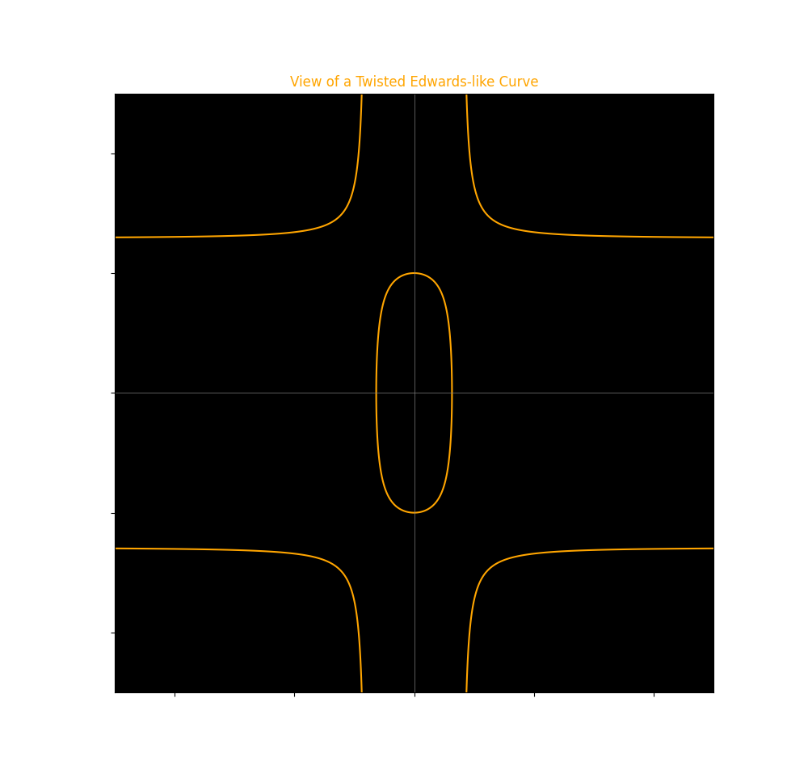
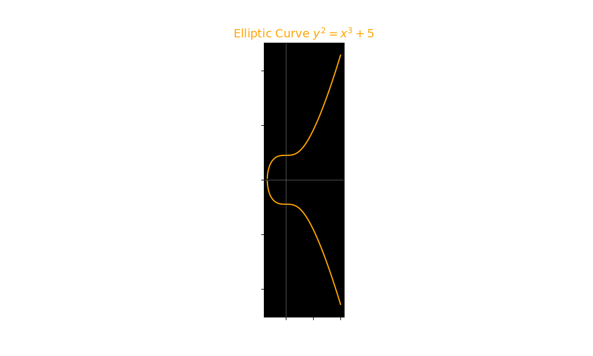
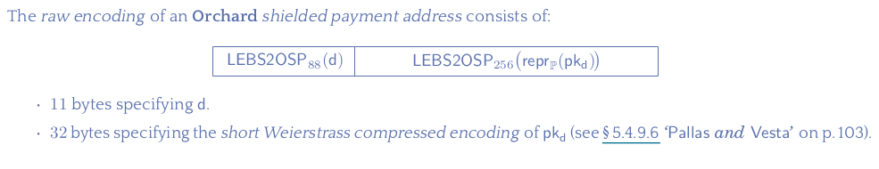

## 7.2.3 Shielded addresses and keys

In this section, we go into the specifics of deriving various keys and addresses from an initial private key within the Zcash protocol's shielded ecosystem. We will discuss the three types of shielded addresses supported by Zcash: Sprout, Sapling, and Orchard, explaining their significance and how they're generated.

Upcoming sections will cover shielded transactions, bridging our understanding of Zcash's protocol and its main features.

### 7.2.3.1 Sprout shielded addresses and keys

This addresses are legacy, there is no RPC method available for creating this type of addresses anymore but they are still part of the protocol and there is still value in the sprout shielded pool. For this reaon and because they are part of the Zcash history we will study them with some level of details here.

Sprout addresses, although legacy, remain an integral part of the Zcash protocol, holding value within the sprout shielded pool. Despite the absence of RPC methods for creating new Sprout addresses, understanding their mechanics is important not only due to their historical significance within Zcash but also because it lays the foundational knowledge necessary for comprehending the advancements and distinctions of later shielding technologies, such as Sapling and Orchard.

The genesis of a Sprout address is a private key, which is essentially a random number selected from a defined finite field.

For Sprout, this finite field consists of integers modulo $2^{252}$. For example, a random number in this field can be:

$6372376510269933859971937989454880171063792566035557767827263364802357389285$

This number, in hexadecimal, is represented as:

`0xe16a32576c1ae7fc50a6eeacfcaf943b8e6f0bb334820f82ebc03bcb94667e5`

This random number serves as the private key, from which several other keys can be derived.

#### Deriving a spending key from the private key

In Zcash's mainnet, a spending key is crafted by appending a fixed prefix to the Base58Check encoding of the private key:

$a_{sk} = {"SK"} \mathbin\Vert Base58Check({private\_key})$

Here, $\mathbin\Vert$ signifies concatenation.

With our example, the spending key would be:

```
SK2iGvKZTsktWmcxysUD7oxhETwymaHQQWDJGfdaeUkuoMVa9wVb
```

#### Deriving the sprout payment address

To derive a Sprout payment address, two components plus a prefix are concatenated:


Where:

- $a_{pk}$: Is the $SHA256Compression$ hash function of the 252 bits private key. 
- $pk_{enc}$: Is a point in the $Curve25519$ elliptic curve clamped from a given private key of 252 bits.

> [!TIP]
> The SHA-256 compression function is a core component of the SHA-256 cryptographic hash algorithm

> [!TIP]
> Curve25519 is a state-of-the-art elliptic curve used for cryptographic purposes, particularly in key agreement protocols like Elliptic Curve Diffie-Hellman (ECDH). Designed by Daniel J. Bernstein, it offers 128 bits of security and is known for its high performance, strong security properties, and simplicity of implementation. The curve operates over a prime field defined by the prime number $2^{255} - 19$, giving the curve its name. The curve equation is $y^3 = x^3 + 486662x^2 + x$.


> [!TIP]
> Clamping is the process that converts a 32-byte (256-bit) sequence into a valid scalar for elliptic curve operations, which ultimately contributes to generating a curve point. This process begins with a raw 32-byte input, which could be a private key, and involves manipulating specific bits in this sequence.

Putting this things together we can build a sprout payment address as follows:

$payment\_address = {"zc"} \mathbin\Vert a_{pk} \mathbin\Vert pk_{enc}$

A sprout payment address may looks as follows:

```
zcHxkDeJqGTRxGV1xYX5vhN2LzBSNpo9qf8QVY1LMYoiXnuDkRTJq8Bb5AWREgFeRmFVh9SzvcG4HAMFzSUZ6GfgNeswZvK
```

### 7.2.3.2 Sapling shielded addresses and keys

Sapling addresses and functionality represent an evolution within the Zcash protocol, offering enhanced efficiency and features compared to their Sprout predecessors. 

A Sapling private key is a random number selected from a finite field of integers modulo $2^{256}$. For instance, a possible private key could be:

$112422864109833081728379801838394881852023339428169431441267193028985383981010$

In hexadecimal notation, this key is represented as:

`0xf88d160e57449510505f57e6d09ef8b5084521ac196fe481a572bcab37168fd2`

From this private key, several other keys can be derived

To derive the Sapling spending key from the private key, Zcash employs a specific encoding named $LEBS2OSP$.

${spending\_key} = LEBS2OSP_{256}({private\_key})$

Where:

- ${LEBS2OSP}_\ell(B)$ is defined for $\ell$ being a multiple of $8$ as: 
    - Converting each 8-bit group in $B$ to a byte, with the least significant bit first.
    - Concatenate these bytes in the original group order.

For example:

```
LEBS2OSP(112422864109833081728379801838394881852023339428169431441267193028985383981010) = 0xd28f1637abbc72a581e46f19ac214508b5f89ed0e6575f50109544570e168df8
```

In the Zcash ecosystem, addresses often undergo a $Base58Check$ encoding for readability and error-checking purposes. The prefix `secret-spending-key-main` is used in Mainnet to denote a Sapling spending key, resulting in an address like:

```
secret-spending-key-main2bjSq7g7aeDndTp4gw3XWVU8jMF6zBNAXLddhN4oK7kcye4Ekc
```

#### Sapling master keys

Following ZIP-32, Zcash wallets transitioned to using sapling extended spending keys. These keys originate from a master key, which in turn is derived from a seed. The seed must be at least 32 bytes and not exceed 252 bytes in length.

For illustration, consider a 32-byte seed in hexadecimal:

```
0x26bb0d6181450ca216851a095a615101fd068783a215a9f5b811bd29f9cedb6e
```

The master key generation algorithm applies the $BLAKE2b−512$ hash function to the seed  $S$ with a prefix "ZcashIP32Sapling":

$I = BLAKE2b-512("ZcashIP32Sapling", S)$

The output $I$ is 64 bytes long, divided into two 32-byte halves. The left half is the master spending key ($sk_m$), and the right half is the master chain code ($c _m$).

The master chain code $c_m$ is crucial for generating a hierarchy of keys, enabling secure and organized key derivation for multiple addresses and functionalities. This hierarchical structure is essential for creating diversified addresses and managing wallet security.

> [!NOTE]
> The BLAKE2b-512 hash function:
> 
> The BLAKE2b-512 hash function is a cryptographic hash function that is part of the BLAKE2 family, designed as an improvement on the BLAKE algorithm, which was a finalist in the NIST hash function competition. BLAKE2b is optimized for 64-bit platforms and is capable of producing hash values of different lengths, with 512 bits (64 bytes) being one of the standard options. It offers high security and is faster than the previous generation hash functions like MD5, SHA-1, and SHA-2, especially in software implementations.

In the Zcash Sapling protocol, whether you start with a spending key or a master key, several components can be derived, each serving distinct roles in various cryptographic processes:

- Spend authorizing key $ask$: Used to authorize spending operations.
- The proof authorizing key $nsk$: Utilized in generating zero-knowledge proofs for transactions, ensuring the spender has the right to spend.
- The outgoing viewing key $ovk$: Allows the holder to view outgoing transaction details without revealing the transaction's value to others.
- The diversifier key $dk$: Used to generate diversified addresses, allowing users to use multiple addresses derived from the same key.

From these components, standard keys are derived for transaction processes:

- Authorizing key $ak$: Derived from $ask$, used in the transaction signing process to prove ownership of the funds being spent. Uses operations in the ellpitic curve **JubJub curve** for derivation.
- Nullifier key $nk$: Derived from $nsk$, used to mark spent notes and prevent double-spending. Derivied using JubJub operations.
- Incoming viewing key $ivk$: Derived from $ak$ and $nk$, allows the holder to view incoming transactions to the addresses derived from the corresponding $dk$.

> [!NOTE]
> JubJub Curve: 
>The JubJub curve is a twisted Edwards curve specifically chosen for its efficiency and security properties, which are ideal for the construction of zero-knowledge proofs within the Zcash protocol. It allows for fast, secure elliptic curve operations essential for generating and verifying transactions in a privacy-preserving manner.



The master extended spending key is the tuple $(ask_m, nsk_m, ovk_m, dk_m, c_m)$

This tuple is then encoded using the encoding formula:

$EncodeExtSKParts(ask, nsk, ovk, dk) := I2LEOSP_{256}(ask) || I2LEOSP_{256}(nsk) || ovk || dk$

#### Sapling child keys

The derivation of Sapling child keys allows for the creation of multiple, distinct addresses from a single master key. This process follows a hierarchical deterministic (HD) structure, enabling efficient management and recovery of addresses.

The formula for deriving child keys is as follows:

$CKD_{\text{Sapling}}(sk_m, i) = sk_i || c_i$

Where:

- $CKD_{\text{Sapling}}$ denotes the child key derivation function for Sapling.
- $sk_m$ is the master spending key.
- $i$ is the index of the child key.
- $sk_i$ is the i-th child spending key.
- $c_i$ is the i-th child chain code.

Each child key can further derive its own child keys, creating a tree-like structure of keys. This is especially useful for organizing addresses into categories (e.g., for receiving, change, or different purposes).

**Example:**

Suppose we have a master spending key 

```
sk_m = 0xf88d160e57449510505f57e6d09ef8b5084521ac196fe481a572bcab37168fd2
``` 

and we wish to derive the first child key (`i=1`).

The derived child key might look something like:

```
sk_1 = 0x123456789abcdef0123456789abcdef0123456789abcdef0123456789abcdef0
```
with its corresponding child chain code 

```
c_1 = 0x0fedcba9876543210fedcba9876543210fedcba9876543210fedcba987654321
```

This hierarchical structure enables a single seed to recover an entire wallet of multiple addresses.

#### Sapling payment address

To derive a Sapling payment address in the Zcash ecosystem, you'll follow a sequence of cryptographic steps. These steps involve using several key components derived from your private spending key, as well as utilizing the JubJub elliptic curve for certain operations. Here's a simplified overview of the process:

**Step 1: Derive Key Components**

First, ensure you have derived the necessary key components:

- Spend Authorizing Key (`ask`): Derived from the private spending key.
- Proof Authorizing Key (`nsk`): Also derived from the private spending key.
- Diversifier Key (`dk`): Used to generate diversified addresses.

**Step 2: Generate the Diversifier**

The diversifier (`d`), a part of the Sapling payment address, is a 11-byte value that ensures the payment address is unique. It's typically found by iterating through possible values until one is found that works with the other components to generate a valid payment address.

**Step 3: Calculate the Diversified Transmission Key**

Using the diversifier `d` and your spend authorizing key `ask`, calculate the diversified transmission key `pk_d`:

- `pk_d = [ask]G_d`, where `G_d` is a diversified base point on the JubJub curve calculated from the diversifier `d`. This operation involves elliptic curve multiplication, which relies on the specific properties of the JubJub curve.

**Step 4: Derive the Incoming Viewing Key**

The incoming viewing key (`ivk`) is derived from `ask` and `nsk`:

`ivk = Hash(ask, nsk)` (simplified), where `Hash` is a specific cryptographic hash function. The actual derivation involves more steps to ensure the key's security and functionality within the Zcash protocol.

**Step 5: Construct the Payment Address**

The Sapling payment address (`zaddr`) is constructed from the diversifier `d` and the diversified transmission key `pk_d`:

- `zaddr = (d, pk_d)`

This address allows users to receive Zcash in a privacy-preserving manner. Transactions sent to this address are shielded, meaning that the transaction's details, such as the sender, receiver, and amount, are encrypted and not publicly visible on the blockchain.

**Step 6: Encode Using Bech32**

Sapling addresses are encoded using Bech32 whjere the human redable part is `zs` for the Zcash Mainnet. An example address might look as:

```
zs1z7rejlpsa98s2rrrfkwmaxu53e4ue0ulcrw0h4x5g8jl04tak0d3mm47vdtahatqrlkngh9sly
```

> [!NOTE]
> Bech32 is a compact, error-detecting encoding scheme designed primarily for encoding addresses in Bitcoin and has since been adopted by various other cryptocurrencies, including Zcash for its Sapling payment addresses.
> A Bech32 encoded string consists of:
>
> - A human-readable part (HRP).
> - A separator, which is always `1`.
> - A data part, which encodes the actual address information and includes a checksum at the end.
>
> Bech32 is kind of a replacement for Base58Check:
> - Bech32 offers superior error detection and potential correction capabilities compared to Base58Check.
> - Bech32 addresses are generally easier to read and transcribe accurately due to their case insensitivity and avoidance of visually similar characters.
> - For equivalent data, Bech32 tends to produce shorter encoded outputs than Base58Check, beneficial for QR codes and UI presentation.

### 7.2.3.3 Orchard shielded addresses and keys

With an understanding of Sprout and Sapling, we now explore the Orchard protocol within the Zcash ecosystem, focusing on its keys and addresses.

#### Orchard master key

The generation of the Orchard master key is straightforward. Starting with a random sequence of bytes known as a seed, the process involves hashing this sequence:

$I = BLAKE2b-512("ZcashIP32Orchard", S)$

This operation yields a 64-byte output, divided into two halves: the left 32 bytes form the master spending key \(sk_m\), and the right 32 bytes constitute the master chain code \(c_m\).

The Orchard master extended spending key is represented by the tuple \((sk_m, c_m)\).

#### Orchard deriving standard keys

Orchard introduces changes from Sapling, notably in its use of a new curve. Unlike Sapling's RedJubjub curve, Orchard utilizes the Pasta curves, with Pallas and Vesta being the two curves part of this set.

> [!NOTE]
> **Pasta Curves**: Introduced in the Orchard protocol, Pasta curves (Pallas and Vesta) are elliptic curves that provide security and efficiency improvements for the Zcash protocol. They support the Halo 2 proving system, which enables recursive proofs without a trusted setup, enhancing both the scalability and privacy of Zcash.



The derivation process in Orchard, similar to Sapling, applies the `toscalar` function on the Pallas curve to derive several key components from the spending key: the spend authorizing key (\(ask\)), the randomized commit (\(rivk\)), the diversifier key (\(dk\)), the incoming viewing key (\(ivk\)), and the outgoing viewing key (\(ovk\)). The specifics of these derivations are detailed in the Zcash protocol documentation, highlighting the complex cryptographic operations involved.

A full viewing key in Orchard is thus the tuple \((ak, nk, rivk)\).

#### Deriving Orchard internal addresses

Orchard allows for the derivation of addresses used for internal operations, such as change transactions or auto-shielding, enhancing privacy and security.

> [!NOTE]
> **Auto-Shielding**: In the context of Zcash, auto-shielding refers to the automatic conversion of transparent funds into shielded funds within a user's wallet. This process increases privacy by moving funds into the shielded pool, where transaction details such as amounts and parties are encrypted.

The derived full viewing key for internal use is defined as \((ak, nk, rivk_{internal})\), where:

\[rivk_{internal} = \text{ToScalar}^{\text{Orchard}}(\text{PRF}^{\text{expand}}(K, [0x83] || \text{I2LEOSP}_{256}(ak) || \text{I2LEOSP}_{256}(nk)))\]

Here, \(K = \text{I2LEBSP}_{256}(rivk)\), applying Orchard-specific cryptographic functions to generate keys tailored for internal operations.


#### Orchard raw payment address

To generate an Orchard raw payment address, combine the diversifier \(d\) and the transmission key \(pk_d\), derived from the master key or other relevant key material. This address allows for receiving shielded funds, maintaining the privacy of transaction details.

The enconing of an orchard raw address is as follows:



There is no Base58 or Bech32 user friendly encoding for raw orchard payment addresses, instead the **unified payment address** should be used, which will be described in the next section.

> [!NOTE]
> The "short Weierstrass compressed encoding" refers to a method of representing elliptic curve points in a compressed format, specifically for elliptic curves defined by the short Weierstrass equation. This method is relevant in the context of cryptographic operations, including those used in blockchain technologies like Zcash.
>
> The short Weierstrass equation is a type of equation used to define elliptic curves over a field. It has the form $y^2 = x^3 + ax + b$ where  $a$ and $b$ are coefficients that determine the specific shape and properties of the elliptic curve, and $x$ and $y$ are the coordinates of points on the curve.

### Unified addresses

Zcash's introduction of Unified Addresses marks a significant advancement, simplifying user interaction with different address types. Unified Addresses encapsulate information for multiple types of addresses (transparent, Sapling, and Orchard) within a single, user-friendly identifier. This innovation facilitates transactions between different pools and address types, streamlining the user experience while preserving privacy and interoperability within the Zcash ecosystem.

TODO: ADD MORE