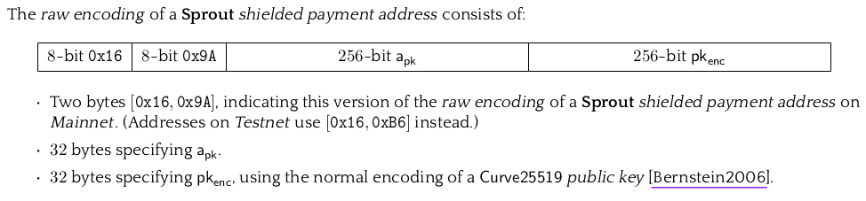
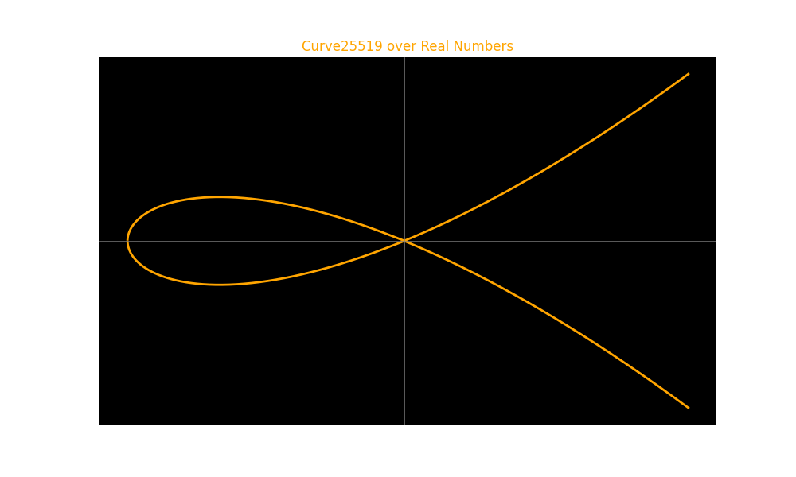

## 7.2.3 Shielded addresses and keys

In this section, we go into the specifics of deriving various keys and addresses from an initial private key within the Zcash protocol's shielded ecosystem. We will discuss the three types of shielded addresses supported by Zcash: Sprout, Sapling, and Orchard, explaining their significance and how they're generated.

Upcoming sections will cover shielded transactions, bridging our understanding of Zcash's protocol and its main features.

### Sprout shielded addresses and keys

This addresses are legacy, there is no RPC method available for creating this type of addresses anymore but they are still part of the protocol and there is still value in the sprout shielded pool. For this reaon and because they are part of the Zcash history we will study them in details here.

Sprout addresses, although legacy, remain an integral part of the Zcash protocol, holding value within the sprout shielded pool. Despite the absence of RPC methods for creating new Sprout addresses, understanding their mechanics is important not only due to their historical significance within Zcash but also because it lays the foundational knowledge necessary for comprehending the advancements and distinctions of later shielding technologies, such as Sapling and Orchard.

The genesis of a Sprout address is a private key, which is essentially a random number selected from a defined finite field.

For Sprout, this finite field consists of integers modulo $2^{252}$. For example, a random number in this field can be:

$6372376510269933859971937989454880171063792566035557767827263364802357389285$

This number, in hexadecimal, is represented as:

`0xe16a32576c1ae7fc50a6eeacfcaf943b8e6f0bb334820f82ebc03bcb94667e5`

This random number serves as the private key, from which several other keys can be derived.

#### Deriving a spending key from the private key

In Zcash's mainnet, a spending key is crafted by appending a fixed prefix to the Base58Check encoding of the private key:

$a_{sk} = {"SK"} \mathbin\Vert Base58Check({private\_key})$

Here, $\mathbin\Vert$ signifies concatenation.

With our example, the spending key would be:

```
SK2iGvKZTsktWmcxysUD7oxhETwymaHQQWDJGfdaeUkuoMVa9wVb
```

#### Deriving the sprout payment address

To derive a Sprout payment address, two components plus a prefix are concatenated:



Where:

- $a_{pk}$: Is the $SHA256Compression$ hash function of the 252 bits private key. 
- $pk_{enc}$: Is a point in the $Curve25519$ elliptic curve clamped from a given private key of 252 bits.

> [!TIP]
> The SHA-256 compression function is a core component of the SHA-256 cryptographic hash algorithm

> [!TIP]
> Curve25519 is a state-of-the-art elliptic curve used for cryptographic purposes, particularly in key agreement protocols like Elliptic Curve Diffie-Hellman (ECDH). Designed by Daniel J. Bernstein, it offers 128 bits of security and is known for its high performance, strong security properties, and simplicity of implementation. The curve operates over a prime field defined by the prime number $2^{255} - 19$, giving the curve its name. The curve equation is $y^3 = x^3 + 486662x^2 + x$.
> 

> [!TIP]
> Clamping is the process that converts a 32-byte (256-bit) sequence into a valid scalar for elliptic curve operations, which ultimately contributes to generating a curve point. This process begins with a raw 32-byte input, which could be a private key, and involves manipulating specific bits in this sequence.

Putting this things together we can build a sprout payment address as follows:

$payment\_address = {"zc"} \mathbin\Vert a_{pk} \mathbin\Vert pk_{enc}$

A sprout payment address may looks as follows:

```
zcHxkDeJqGTRxGV1xYX5vhN2LzBSNpo9qf8QVY1LMYoiXnuDkRTJq8Bb5AWREgFeRmFVh9SzvcG4HAMFzSUZ6GfgNeswZvK
```
