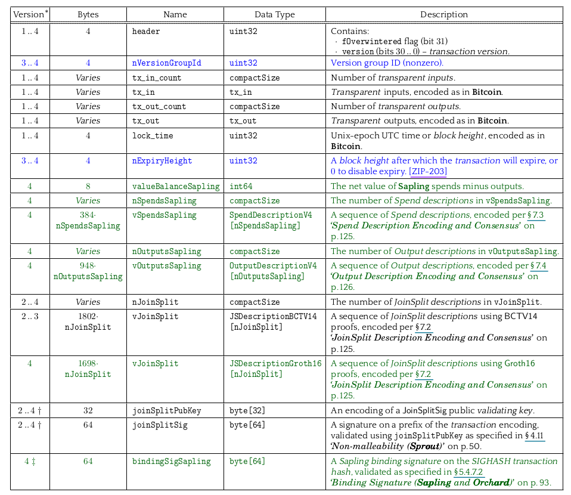
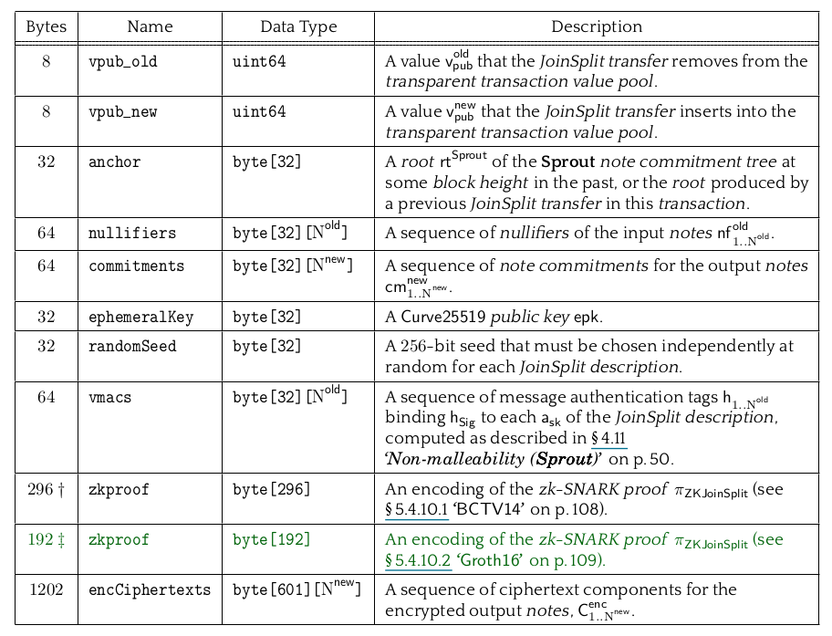
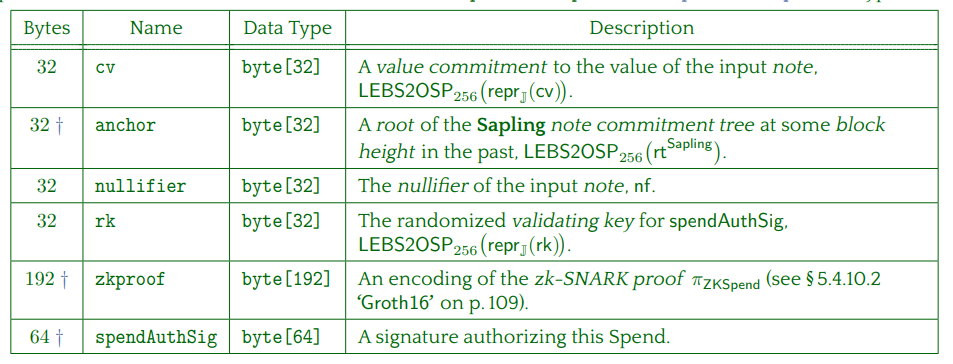
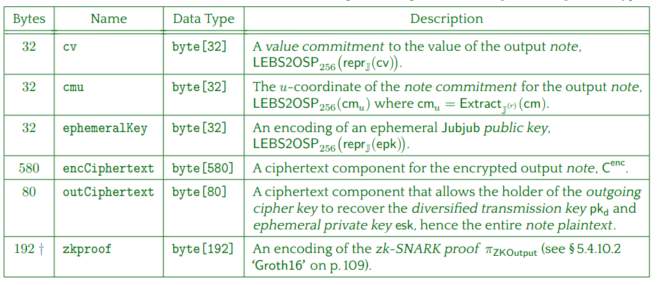
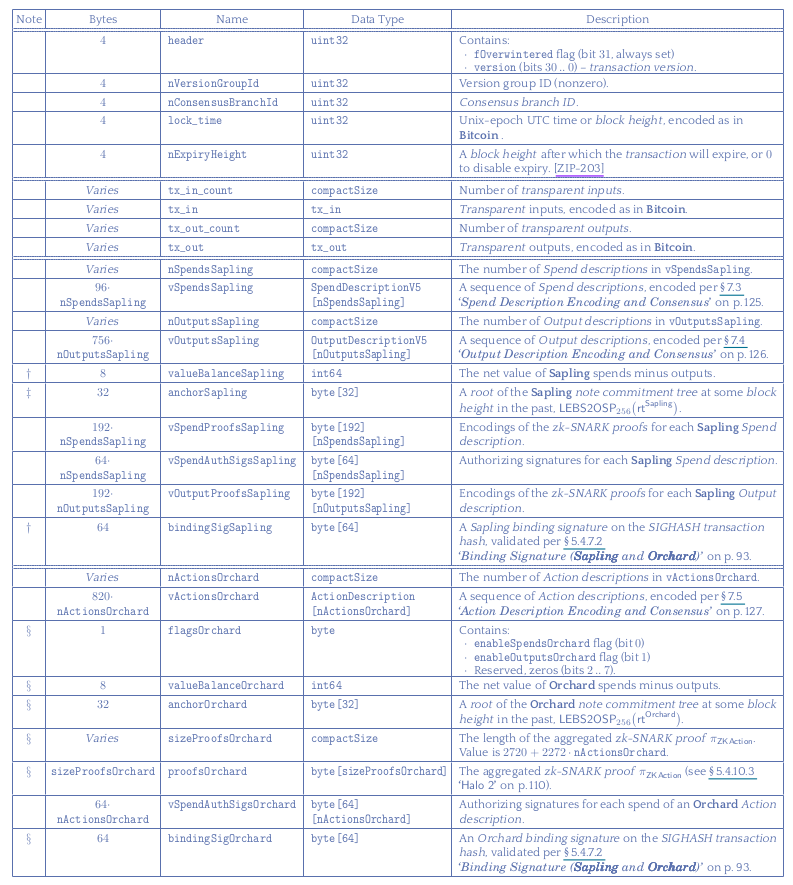
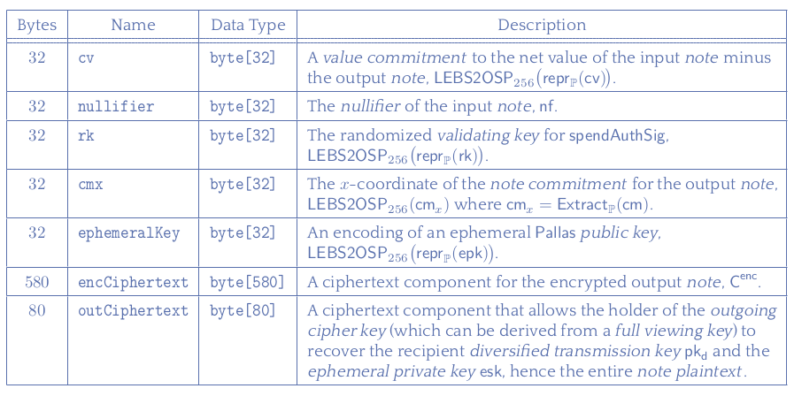

## 7.2.4 Shielded transactions

Now that we have a very good understanding of shielded addresses and keys, it is time to see them in action and understand how they fit inside transactions that protect the privacy of Zcash users.

At the moment, the Zcash protocol supports two versions of transactions that are encoded inside blocks. These currently supported transaction versions are version 4 and version 5. The main difference between them is that version 4 allows for both Sprout and Sapling transactions, while version 5 supports Sapling and Orchard transactions.

The recommended transaction version for new software to use is, of course, version 5, while version 4 is there to support legacy Sprout transactions. Let's define the components of each transaction type.

Before actually going into how each protocol version (Sprout, Sapling, Orchard) handles shielded transactions, there are some general concepts that we should learn:

### Notes

A note represents the amount of Zcash (ZEC) that is being transferred in a shielded transaction. It contains information about the value being transferred and the recipient's address but does not reveal this information on the blockchain. Notes are part of the encrypted data that only the recipient can decrypt using their private viewing key.

### Note Commitment

A note commitment is a cryptographic commitment to the contents of a note, including the amount and the recipient's shielded address. When a note is created in a transaction, its commitment is publicly recorded on the blockchain. However, the commitment is designed such that it's computationally infeasible to derive the note's contents from it, ensuring the privacy of the transaction.

### Note Commitment Tree

The Note Commitment Tree is a Merkle tree that aggregates all the note commitments created from transactions into a single structure. Each time a note commitment is created, it is appended to the tree. The root of this tree (the Merkle root) is updated and included in the blockchain's block header. This structure allows for efficient verification of the existence of a note commitment within the tree without revealing its position or the details of other notes, contributing to the privacy and integrity of shielded transactions.

### Nullifiers

A nullifier is derived from a shielded note and is used to prevent double-spending. When a note is spent in a transaction, its nullifier is revealed and recorded on the blockchain. This nullifier is a unique identifier for the note but does not disclose any information about the note itself. Network participants can check the list of nullifiers to ensure that a note has not been spent twice without knowing anything about the note's value or recipient.

### 7.2.4.1 Sprout transactions

The main component of Sprout transactions is the notion of JoinSplits. JoinSplits are specific to the Sprout phase of Zcash and serve as the cornerstone of Zcash's privacy features in this phase. They enable the transaction to hide the sender, receiver, and amount transferred, providing privacy and interchangeability to Zcash transactions.

#### JoinSplit transactions

JoinSplit transactions conceal the transaction details from everyone except the sender and receiver. This includes hiding the identities of the sender and receiver and the amount being transferred, using zk-SNARKs to ensure that transactions are valid without revealing these details. 

Each JoinSplit transaction involves the combination of inputs (funds) from multiple sources (joining) and allocation to multiple outputs (splitting), within a single transaction. This process obscures the flow of funds, adding an additional layer of privacy. This combination of components is known as joinsplit descriptions.

A **JoinSplit description** includes encrypted transaction details, a zk-SNARK proof to validate the transaction's integrity and privacy, and, when applicable, any transparent inputs or outputs. These components ensure that while the transaction is verifiable by the network, the privacy of the transaction participants is maintained.

A **JoinSplit transfer** is an individual shielded value transfer.

I think we are in a good position to figure out how all this works by going to the encoding of a v4 transaction and exploring the fields related to the Sprout shielded transactions.

Where we are interested in just some of the fields:

- `nJoinSplit`: Is just the number of joinsplit inside this transaction.
- `vJoinSplit`: Is the actual collection of joinsplits descriptions. Before Sapling network upgrade the zk-SNARKs used for proofs of JoinSplits were **BCTV14** while after Sapling network upgrade the joinsplit are proved using **Groth16** zk-SNARK.
- `joinSplitPubKey`: This is a public key used in the process of creating a JoinSplit transaction. Specifically, it's part of the mechanism for producing a signature (`joinSplitSig`) that proves the transaction was created by someone with the appropriate private key. This public key is associated with the encrypted data within the JoinSplit description, ensuring that the transaction cannot be tampered with without the corresponding private key.
- `joinSplitSig`: This signature is generated using the private key corresponding to the `joinSplitPubKey` and is applied to the entire transaction, including all its JoinSplit descriptions. It serves as a cryptographic proof that the person creating the transaction had the right to spend the inputs and create the outputs detailed in the JoinSplits. The `joinSplitSig` helps in ensuring the integrity and non-repudiation of the transaction by verifying it was indeed the holder of the private keys who authorized the transaction. This signature is essential for the network to verify the authenticity and integrity of the JoinSplit transaction without revealing the private details enclosed within.

> [!NOTE]
> BCTV14 and Groth16:
>
> They are both types of zk-SNARKs. 
> BCTV14 is named after its creators — Jens Groth, Alessandro Chiesa, Eran Tromer, and Madars Virza — and was introduced in 2014. It was the first zk-SNARK construction used by Zcash to enable privacy-preserving transactions.
> Groth16 was introduced by Jens Groth in 2016 and represented a significant improvement over BCTV14 and other previous zk-SNARK constructions. It was adopted in the Sapling upgrade of Zcash significantly reducing both the proof sizes and the verification times, making transactions faster and more scalable mantaining the same level of security of .
> Groth16 was introduced by Jens Groth in 2016 and represented a significant improvement over BCTV14 and other previous zk-SNARK constructions. It was adopted in the Sapling upgrade of Zcash significantly reducing both the proof sizes and the verification times, making transactions faster and more scalable mantaining the same level of security of BCTV14.

We then just need to then check the encoding of a JoinSplit:

Where:

- `vpub_old`: The amount of ZEC being spent (if any) from transparent value to shielded.
- `vpub_new`: The amount of ZEC being created (if any) from shielded to transparent value in this JoinSplit.
- `anchor`: A reference to a recent state of the blockchain (Merkle root) to ensure the transaction spends notes that existed at the time of the transaction.
- `nullifiers`: Unique identifiers derived from the shielded inputs to prevent double-spending.
- `commitments`: Cryptographic commitments to the new shielded notes being created by this JoinSplit.
- `ephemeralKey`: A temporary public key used in encrypting the shielded notes sent to the receiver.
- `randomSeed`: Used with the ephemeral key to provide randomness in the encryption process.
- `vmacs`: Verification keys used to prove that the transaction has been authorized by the owner(s) of the shielded inputs.
- `zkproof`: A zero-knowledge proof that ensures all components of the JoinSplit transaction are correct without revealing any sensitive - information.
- `encCipherTexts`: Encrypted text containing the information about the shielded outputs (notes) that only the recipient can decrypt.

Here is a really good explication of how the pieces fit together:

> Value is carried by "notes" which specify an amount and a public key. To each note there is cryptographically associated a commitment, and a nullifier (so that there is a 1:1:1 relation between notes, commitments, and nullifiers).
>
>Each JoinSplit takes in a transparent value and up to two input notes, and produces a transparent value and up to two output notes. The nullifiers of the input notes are revealed (thus preventing them from being spent again) and the commitments of the output notes are revealed (this allowing them to be spent in future). Each JoinSplit also includes a computationally sound zero-knowledge proof-of-knowledge (SNARK) which proves all of the following:
>
>- The inputs and outputs balance (individually for each JoinSplit).
>- For each input note of non-zero value, some revealed commitment exists for that note.
> - The prover knew the private keys of the input notes.
> - The nullifiers and commitments are computed correctly.
> - The private keys of the input notes are cryptographically linked to a signature over the whole transaction, in such a way that the transaction cannot be modified by a party who did not know these private keys.
> - Each output note is generated in such a way that its nullifier will not collide with the nullifier of any other note.
>
>Outside the SNARK, it is also checked that the nullifiers for the input notes had not already been revealed (i.e. they had not already been spent).
>
>https://forum.zcashcommunity.com/t/is-my-understanding-of-how-zcash-works-correct/961/6

### 7.2.4.2 Sapling transactions

To understand Sapling transactions we can refer to the same image of the v4 transaction fields, we now pay attentioon to this fields:

- `valueBalanceSapling`: Is the value of the spends minus the outputs for this transaction.
- `nSpendsSapling`: Just the number of Sapling Spends in this transaction.
- `vSpendsSapling`: The actual list of spends.
- `nOutputsSapling`: Just the number of Sapling outputs in this transaction.
- `vOutputsSapling`: The actual list of outputs.

To understand more we need to refer to the encoding of the Sapling spends:

Where:

- `cv` (Value Commitment): Represents a commitment to the value of the input note being spent. It's a cryptographic commitment that allows the network to verify the amount without revealing the actual value, contributing to the privacy of the transaction.
- `anchor`: This is the Merkle root of the Sapling note commitment tree at the time the output notes were created. It serves as a reference point, ensuring that only existing notes can be spent, which enhances the security of the blockchain against double-spending and other fraudulent activities.
- `nullifier`: Acts as a proof that the note has been spent and prevents double-spending. It's a unique identifier derived from the input note, and once a nullifier is used, it cannot be used again, ensuring the integrity of the monetary supply.
- `zkproof` (Zero-Knowledge Proof): A Groth16 zk-SNARK proof that validates the transaction without revealing any sensitive information about the input note or its value. It ensures the transaction meets all necessary conditions (like the correct creation of nullifiers and value commitments) without compromising privacy.
- `spendAuthSig` (Spend Authorization Signature): A signature over the transaction, proving that the spender owns the private key associated with the note being spent. It prevents unauthorized spending of notes and adds an additional layer of security to the transaction.

And the sapling outputs:

Where:

- `cv` (Value Commitment): Similar to the input side, this represents a commitment to the value of the output note, allowing the transaction to hide the actual amount being transferred.
- `cmu`: The u-coordinate of the note commitment for the output note. This coordinate is used to uniquely identify the note commitment in the Sapling note commitment tree, ensuring the uniqueness and validity of the output note within the blockchain.
- `ephemeralKey`: A temporary public key used to encrypt the output note information (such as the value and the recipient's address) for the receiver. The receiver can use their private viewing key to decrypt this information, allowing them to spend the note in the future while keeping the transaction details hidden from others.
- `encCipherText`: The encrypted information about the output note, which includes details like the value and recipient's shielded address. Only the intended recipient, who possesses the corresponding private viewing key, can decrypt and access this information, maintaining the privacy of the transaction.
- `zkproof` (Zero-Knowledge Proof): A Groth16 zk-SNARK proof for the output, similar to the input side, which validates the creation of the output without revealing any underlying details to the blockchain. This ensures that the output adheres to the network's consensus rules while preserving privacy.

#### Integrating Sapling into Zcash Transactions

The introduction of Sapling in Zcash transactions marked a significant evolution in the protocol’s approach to privacy and efficiency.

At its core, a Zcash transaction may include a mix of transparent and shielded transfers. The process begins with the `valueBalanceSapling`, a field that reflects the net value transfer between the transparent and shielded pools within a transaction. This balance adjustment ensures that the transaction's total input value matches its total output value, maintaining the principle of conservation of value across the Zcash network.

**Sapling Spends** (`vSpendsSapling`) allow users to consume existing shielded notes. For each spend, a zero-knowledge proof (`zkproof`) validates the right to spend without revealing the note's value or the spender's identity. The `nullifier` associated with each spent note prevents double-spending, while the `spendAuthSig` confirms the spender’s authorization.

**Sapling Outputs** (`vOutputsSapling`) are the transaction's destinations for new shielded notes. These outputs encrypt details about the value and recipient, making the information accessible only to intended recipients. This encryption, facilitated by the `ephemeralKey`, secures the transfer of value while preserving the privacy of the transaction details.

#### Benefits Over Sprout

Compared to its predecessor, Sprout, Sapling introduces several key improvements:

- **Efficiency**: Sapling reduces the time and memory required to construct shielded transactions. This efficiency gain is primarily due to the optimized zero-knowledge proving system (Groth16), which offers smaller proof sizes and faster verification times.

- **Privacy**: Sapling strengthens privacy through improved key management. The protocol allows users to view incoming transactions without revealing their private spending keys, thanks to the introduction of viewing keys and diversified addresses.

- **User Experience**: The enhancements in efficiency significantly improve the user experience by making transactions faster and less resource-intensive. This improvement makes shielded transactions more accessible to a broader range of users and devices, potentially increasing the adoption of privacy features.

- **Delegation Capabilities**: Sapling's viewing keys enable the delegation of transaction viewing capabilities without compromising the security of the funds. This feature allows for more flexible privacy controls and the potential for third-party auditing in a privacy-preserving manner.

In summary, the integration of Sapling components into Zcash v4 transactions represents a significant leap forward in the pursuit of a more private, efficient, and user-friendly digital currency. By addressing the limitations of the Sprout protocol, Sapling sets a new standard for privacy-preserving transactions in the blockchain space.

### 7.2.4.3 Orchard transactions

Orchard transactions are encapsulated in the Zcash transaction version 5 (v5), which also accommodates transparent and Sapling data. Orchard introduces new mechanisms for shielded transactions, leveraging the latest advancements in zero-knowledge proofs to enhance privacy and efficiency.

Where:

- `nActionsOrchard`: This field specifies the number of Orchard actions contained within the transaction.
- `vActionsOrchard`: Represents the list of Orchard actions. Each action details how funds are moved or transformed within the Orchard shielded pool, including the creation of new shielded outputs or the spending of existing ones.
- `flagsOrchard`: A set of flags that indicate various options or features enabled for each Orchard action. This can include flags for specifying the type of action or for enabling certain privacy features.
- `sizeProofOrchard`: Denotes the size of the aggregated zero-knowledge proof for all actions in the transaction. Orchard uses the Halo 2 proving system, which allows for recursive proofs without the need for a trusted setup. This field reflects the compactness and efficiency of these proofs.
- `vSpendAuthSigsOrchard`: A list of spend authorization signatures corresponding to each Orchard action. These signatures prove that the transaction creator is authorized to spend the specified inputs, enhancing the security of the transaction.
- `bindingSigOrchard`: A binding signature that covers the entire transaction, ensuring its integrity. It guarantees that the transaction has not been tampered with and that the sum of the inputs and outputs, including any fees, balances correctly.

We now check the Actions themselves:

Where:

- `cv` (Value Commitment): A commitment to the net value being transferred by the action. It ensures the value privacy of the inputs and outputs while allowing the network to verify the transaction's balance.

- `nullifier`: Serves as a proof that a particular note has been spent, preventing double-spending of funds. Each nullifier is unique to its corresponding note.

- `rk` (Randomized Public Key): Used in the generation of spend authorization signatures, allowing for flexible key management and enhancing privacy by preventing linkability of transactions.

- `cmx` (Commitment to the Note): A unique identifier for the note commitment, ensuring that each note is unique and cannot be duplicated within the blockchain.

- `ephemeralKey`: A temporary key used for encrypting information sent to the recipient of a transaction, allowing only the intended recipient to decrypt and access the note's contents.

- `encCipherText`: The encrypted content of the output note, including its value and recipient information, ensuring that transaction details remain private.

- `outCipherText`: Additional encrypted output data, which may include recipient information or other data relevant to the transaction, further securing the privacy of transaction details.

Orchard transactions, through these fields and the use of the Halo 2 proof system, significantly improve the scalability and privacy of Zcash. By removing the need for a trusted setup and enabling more efficient proof generation and verification, Orchard allows Zcash to offer enhanced security and privacy to its users, setting a new standard for privacy-focused cryptocurrencies.

> [!NOTE]
> Halo 2 is an advanced cryptographic proving system that underpins the Orchard protocol in Zcash, representing a significant leap in the development of zero-knowledge proofs (ZKPs). Unlike previous generations of ZKP systems used in Zcash, such as those based on the zk-SNARKs in the Sprout and Sapling protocols, Halo 2 does not require a trusted setup. This characteristic is crucial for enhancing the security and trustworthiness of the protocol, as it eliminates the possibility of a compromised setup undermining the entire system.
>
>The innovation behind Halo 2 lies in its use of recursive proof composition. This technique allows proofs to verify other proofs, which drastically reduces both the computational overhead and the size of the proofs themselves. As a result, Halo 2 enables more efficient verification and smaller transaction sizes, significantly improving scalability and performance.
>
>Furthermore, Halo 2 facilitates the implementation of more complex and flexible privacy features within Zcash, allowing for a richer set of transaction types without sacrificing efficiency. The absence of a trusted setup and the introduction of recursive proofs mark a pivotal development in the field of cryptography, offering a more robust foundation for privacy-preserving digital currencies like Zcash.

#### Integrating Orchard into Zcash Transactions

The heart of an Orchard transaction lies in its actions (`vActionsOrchard`), which encapsulate the movement of ZEC within the Orchard shielded pool. Each action is a detailed record that includes the input (if spending), the output (if creating new ZEC), and all the necessary cryptographic proofs to validate the transaction without compromising privacy.

- **Action Composition**: An action includes value commitments (`cv`), `nullifiers` for spent notes, and the new commitments (`cmx`) for any created notes, alongside the necessary zk-SNARK proofs to verify these elements without revealing underlying data.

- **Privacy and Security Features**: Powered by the novel Halo 2 proving system, Orchard actions do not require a trusted setup, mitigating potential security risks associated with initial parameter generation. This improvement significantly reduces the blockchain’s exposure to vulnerabilities related to the setup phase.

- **Efficient Verification and Compact Proofs**: The recursive proof composition enabled by Halo 2 allows Orchard transactions to be verified quickly and efficiently, contributing to a scalable blockchain ecosystem that can handle higher volumes of transactions without compromising speed or security.

#### Benefits Over Sapling and Sprout

**Elimination of Trusted Setup**:

Orchard, through its use of the Halo 2 proving system, eliminates the need for a trusted setup.

**Improved Scalability and Efficiency**:

Thanks to the recursive nature of Halo 2 proofs, Orchard transactions are more scalable and efficient. The proofs are both smaller in size and faster to verify compared to those used in Sapling and Sprout, leading to quicker transaction processing times and lower costs, even as the network grows.

**Enhanced Privacy**:

Orchard builds on the privacy features of Sapling but with additional improvements. The use of Halo 2 allows for more sophisticated encryption techniques and the possibility for future privacy features without sacrificing efficiency or requiring a trusted setup.

**Greater Flexibility**:

The architecture of Orchard, coupled with the Halo 2 proving system, lays the groundwork for more complex and flexible transaction types. 

