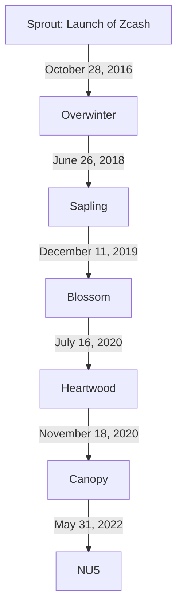

# 7.2 Shielded World

Building on our understanding of the Zcash's transparent world, let's explore into the more private side of Zcash with shielded addresses and transactions, the features that truly set Zcash apart in the blockchain space.

## 7.2.1 Value pools

The Zcash blockchain is structured around various value pools, each corresponding to a different type of address or stage of the network's evolution. These pools include:

- Transparent Pool: Contains all funds in transparent addresses, similar to Bitcoin's transaction model.
- Sprout Pool: The initial shielded pool, to be deprecated, representing the first implementation of private transactions.
- Sapling Pool: Represents the next evolution, introducing improved efficiency and privacy.
- Orchard Pool: The latest advancement in Zcash's privacy technology.

The total of these pools equates to the sum of ZEC in circulation. The `getblockchaininfo` RPC method allows users to check the total value in each pool, providing transparency into the distribution of ZEC across different address types.

## 7.2.2 Evolution of Shielded Technology

The evolution of shielded technology in Zcash shows its pioneering journey towards privacy within the blockchain space.

### Sprout: The Foundation of Privacy

Sprout, introduced at Zcash's launch on October 28, 2016, marked the first implementation of shielded transactions using zk-SNARKs. This was a groundbreaking technology designed to enable transaction verification without revealing sensitive information. 

### Sapling: Boosting Efficiency and Adoption

The Sapling network upgrade, activated on October 29, 2018, significantly improved the efficiency and usability of shielded transactions. It introduced new shielded addresses with improved transaction speed and memory usage. This upgrade facilitated mobile apps, exchanges, and vendor adoption of Zcash by making private transactions more practical for everyday use. One of the key features of Sapling was the decoupling of the spending authority from the ability to see transactions with the introduction of the viewing keys.

### Orchard: Advancing Privacy with Halo 2

Orchard, part of the Network Upgrade 5 (NU5) activated in May 2022, represented the latest advancement in Zcash's privacy technology. It incorporates the Halo 2 proving system, eliminating the need for a trusted setup previously required for generating zk-SNARKs. This upgrade also introduced the concept of Unified Addresses, simplifying the user experience by supporting both shielded and transparent transactions within a single address format.

### Zcash Main Network Upgrades

> [!TIP] 
> Trusted setups
>  
> TODO
>

