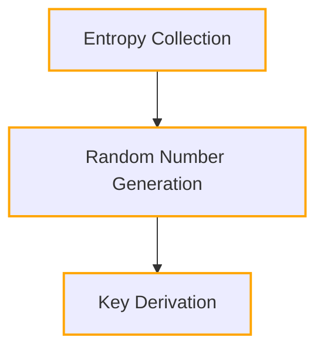
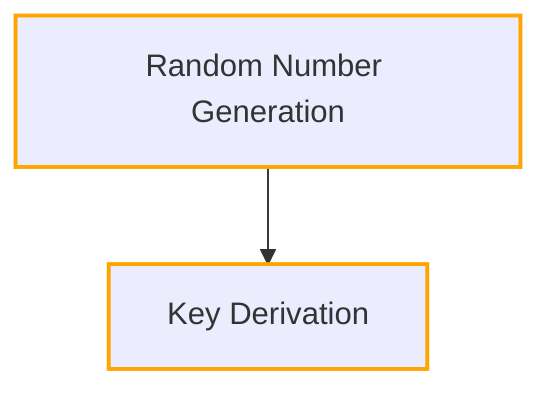
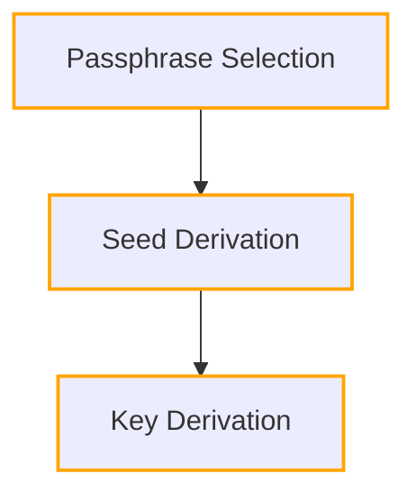

# 7.1 Transparent Addresses

In cryptocurrency, particularly in Zcash, a wallet is essentially a collection of keys. Initially, a private key is generated, from which a corresponding public key is derived. Subsequently, a hash function is applied to the public key, resulting in a payment address. This address serves as the destination for incoming funds.

## 7.1.1 Generating Keys

Private and public keys are numerical representations, specifically generated by solving elliptic curve equations. The elliptic curve utilized for Zcash's transparent addresses is [secp256k1](https://en.bitcoin.it/wiki/Secp256k1), the same curve employed in the Bitcoin protocol:

$y^2 = x^3 + 7$

This curve operates over a finite field $F_p$, where $p$ is an exceedingly large prime number. In practical terms, this means that the curve's function operates within a finite subset of numbers, rather than over all possible numbers. The use of a finite field ensures that computations on the curve remain efficient and manageable, even with large prime numbers.

Here is a visualization of the secp256k1 curve with the Real numbers as the domain of the function. It's important to note that while this visualization helps in understanding the curve's shape, the actual domain used in cryptographic operations is not the real numbers, but rather the finite field $F_p$.

In Zcash, cryptographic keys can be generated through various methods, each offering unique advantages in terms of security and usability. Here, we explore three common approaches:

### Random Number Generator (RNG):

One method for generating keys involves using a Random Number Generator (RNG) to produce a random seed, which is then used as input for key derivation. RNGs are algorithms or hardware devices designed to generate unpredictable and statistically random numbers, ensuring cryptographic strength.

**Advantages:**

- Cryptographic Strength: Random seeds provide strong cryptographic security.
- Unpredictability: RNG-generated keys are highly unpredictable and resistant to attacks.
- Scalability: RNG-based key generation can easily scale to generate large numbers of keys.

**Example:**

- Random Seed (Decimal): 68123456789012345678901234567890123456789012345678901234567890123
- Random Seed (Hexadecimal): 0x3B9ACA0057BE5C5E3A44F5B17E2FC1DAA17F1E15398A4C9A5B6A0A6FD73F13CB
- Explanation: The example illustrates a random seed generated by an RNG. This seed serves as the basis for deriving cryptographic keys.

### Random Number as Seed:

Another approach involves generating a random number directly, which serves as the seed for key derivation. This method offers simplicity and efficiency, as it eliminates the need for additional entropy collection steps.

**Advantages:**

- Simplicity: Directly using a random number simplifies the key generation process.
- Efficiency: Eliminates the need for additional entropy collection steps.

**Example:**

- Random Number (Decimal): 67243210987654321098765432109876543210987654321098765432109876543
- Random Number (Hexadecimal): 0x3B9ACA0057BE5C5E3A44F5B17E2FC1DAA17F1E15398A4C9A5B6A0A6FD73F13CB
- Explanation: In this example, a random number is generated directly and used as the seed for key derivation, bypassing the need for entropy collection.

### Passphrase-Based Key Generation (Recommended):

The recommended approach involves generating keys based on a memorable passphrase. This method leverages a passphrase as input to derive a seed, which is then used for key derivation. Passphrase-based key generation offers usability and accessibility advantages, as users can easily remember their passphrase.

**Advantages:**

- Usability: Passphrase-based key generation is user-friendly and easy to remember.
- Accessibility: Users can access their keys using a passphrase, enhancing usability.

**Example:**

- Passphrase: "MySecretPassphrase123!"
- Explanation: In this example, a passphrase "MySecretPassphrase123!" is chosen. A key derivation function is applied to convert the passphrase into a seed, which is then used to derive cryptographic keys. Passphrase-based key generation offers the advantage of usability and accessibility, as users can easily remember their passphrase and derive keys from it.

