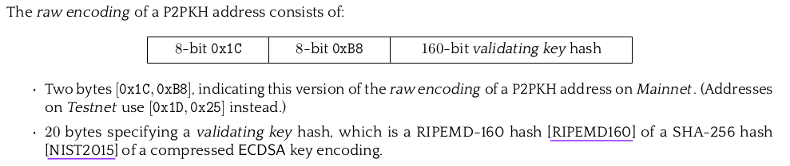

## 7.1.3 Transparent addresses

In Zcash transparent world, a **public key hash** is created by applying two hash functions to the public key, just as in Bitcoin:

$public\\_key\\_hash = RIPEMD160(SHA256(public\\_key))$

Where:

- $SHA256$: This hash function produces a secure, fixed-length output of $X$ bits.
- $RIPEMD160$: This hash function generates a slightly less secure, fixed-length output of $Y$ bits. Where $Y < X$

RIPEMD160 is considered less secure but produces a smaller output, which is desirable in large-scale blockchains. On the other hand, SHA256 is considered more secure but with a larger output. Thus, the solution at the time of Bitcoin's creation was to obtain a secure hash with SHA256 and then compress the output size by applying RIPEMD160.

> [!NOTE]
> A hash function is a mathematical algorithm that takes an input (or "message") and produces a fixed-size string of bytes, which is typically a hexadecimal number. The output is often referred to as the hash value, hash code, or digest. There are many hash functions, let's see a bit more detail in the ones we already used: 
> 
> **SHA256** (Secure Hash Algorithm 256):
> 
> - SHA256 is a widely used cryptographic hash function that produces a 256-bit (32-byte) hash value.
> - It takes an input message of any size and produces a fixed-size output hash value.
> - The output hash value is typically represented as a 64-character hexadecimal string.
> 
> Example:
> - Input: "Hello, world!"
> - SHA256 Hash: "315f5bdb76d078c43b8ac0064e4a0164612b1fce77c869345bfc94c75894edd3"
>
> **RIPEMD160** (RACE Integrity Primitives Evaluation Message Digest 160):
>
>- RIPEMD160 is a cryptographic hash function that produces a 160-bit (20-byte) hash value.
>- It is designed to be faster than SHA-1 and MD5 but is considered less secure than SHA256.
>- The output hash value is typically represented as a 40-character hexadecimal string.
>
> Example:
> - Input: "Hello, world!"
> - RIPEMD160 Hash: "58262d1fbdbe4530d8865d3518c6d6e41002610f"

In Zcash, transparent addresses serve as identifiers for receiving funds in transparent transactions. There are two types of transparent addresses, which correspond to address types in the Bitcoin protocol: **P2SH** (Pay to Script Hash) and **P2PKH** (Pay to Public Key Hash).

### P2PKH addresses

P2PKH addresses in Zcash are derived from the public key hash. Here's how they are encoded:

The diagram illustrates that the last 20 bytes represent the public key hash we studied earlier. To create a P2PKH address, the public key hash is encoded using **Base58Check**, with the prefix `t3` for the Zcash Mainnet:

$transparent\\_address = 't3' \mathbin\Vert Base58Check(public\\_key\\_hash)$

For example, if the Base58Check for the public key hash `58262d1fbdbe4530d8865d3518c6d6e41002610f` is `936CR3RBty2VxQWX2MgKk6vz63LTAm1UD`, then the corresponding Zcash Mainnet transparent address would be `t3936CR3RBty2VxQWX2MgKk6vz63LTAm1UD`.

> [!NOTE]
> Transparent addresses in Zcash are commonly referred to as **transparent payment addresses**, as they are used to receive funds in transparent transactions.

> [!NOTE]
> The Base58Check encoding is a way to encode byte arrays into into human-typable strings.

### P2SH addresses

P2SH addresses in Zcash are derived from a script hash instead of a public key hash. This type of address allows users to send transactions to a script's hash (essentially a digital fingerprint of a complex script) rather than to a specific public key or public key hash. Here's the general process for creating P2SH addresses:

First, a script is created. This could be any script, but it typically involves conditions for spending the coins, such as requiring signatures from multiple parties (multisig) or fulfilling other specific conditions.

The script is then hashed using SHA256 and RIPEMD160, similar to how the public key hash is generated for P2PKH addresses. This produces a 20-byte script hash.

The script hash is then encoded using `Base58Check` encoding, with the prefix t2 for the Zcash Mainnet, to produce a P2SH address.

The process can be summarized by the formula:

$P2SH\_address = 't2' \mathbin\Vert Base58Check(script\_hash)$

For example, if a script's SHA256 and RIPEMD160 hash results in `3e23e8160039594a33894f6564e1b1f46829c2a3`, and its Base58Check encoding is `X7Jknp2qvUd4D4Rx8JxzyTJ4aL3KnvEtT`, then the corresponding Zcash Mainnet P2SH address would be `t2X7Jknp2qvUd4D4Rx8JxzyTJ4aL3KnvEtT`.

