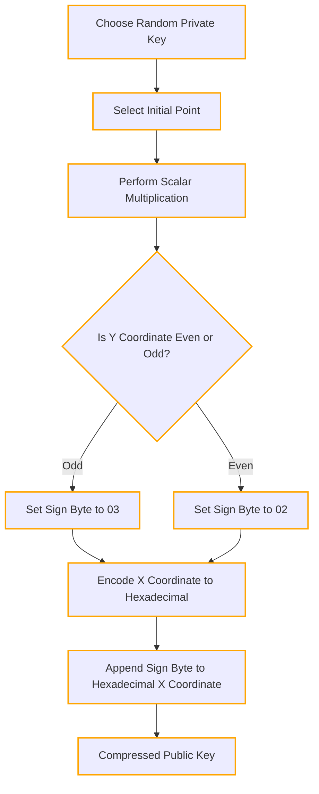

## 7.1.2 Understanding Zcash Transparent Public Keys

In Zcash, public keys are important components in enabling transparent transactions. Here's a breakdown of hoiw they are derived, from the private key:

A public key is derived from the private key through elliptic curve point multiplication, utilizing the parameters of the secp256k1 curve. The secp256k1 curve is defined by the equation: $y^2 = x^3 + 7$

This curve is specifically chosen for its cryptographic properties, including its resistance to various types of attacks.

The multiplication of a private key (a random number) with a starting point on the curve results in an X and Y coordinate pair representing a valid point on the curve, this is for our purposes the derived public key.

Let's see the process step by step:

- Choose a Random Private Key (Scalar): Let's select a random private key $d$ as our scalar.

- Select the Initial Point (Generator Point): In elliptic curve cryptography, there is a fixed point called the generator point (often denoted as $G$) on the curve. For the secp256k1 curve used in Zcash, the generator point is predetermined. Let's assume $G$ is a known generator point on the secp256k1 curve.

- Perform Scalar Multiplication: We perform scalar multiplication of the generator point $G$ by the private key $d$ to obtain the public key coordinates. The formula for scalar multiplication is:

  $P = d × G$

  Where:
  - $P$ is the resulting point (public key).
  - $d$ is the private key (scalar).
  - $G$ is the generator point.

- Encode the Public Key Coordinates: Once we have the $X$ and $Y$ coordinates of the resulting point $P$, we encode them into a compressed format to represent the public key:
  - Determine the Sign of Y: Check if the $Y$ coordinate is even or odd. If $Y$ is even, the sign byte is 02; if $Y$ is odd, the sign byte is 03.
  - Encode the X Coordinate to Hexadecimal: Convert the $X$ coordinate into a hexadecimal string.
  - Append the Sign Byte to Hexadecimal X Coordinate: Concatenate the sign byte to the beginning of the hexadecimal string representing the $X$ coordinate.

### Example

Given:

- Private Key ($d$): 1234
- Generator Point ($G$): (X, Y) = (5, 7)

Obtain public key:

1. **Choose Random Private Key (Scalar):** $d = 1234$
2. **Select Initial Point (Generator Point):** $G = (5, 7)$
3. **Perform Scalar Multiplication:**
   - Start with $P = \text{Identity Element}$ (0 in this case).
   - Iterate $d$ times, adding $G$ to $P$ each time.
   - For example: $P = 1G + 2G + 3G + ... + 1234G$
4. **Determine Sign of $Y$:** $Y$ is odd (7), so the sign byte is 03.
5. **Encode X Coordinate to Hexadecimal:** $X = 5$ which in hexadecimal is $0x5$.
6. **Append Sign Byte to Hexadecimal X Coordinate:** Concatenate the sign byte 03 to $0x5$ resulting in $0305$.
7. **Compressed Public Key:** $\text{Compressed Public Key} = 0305$
