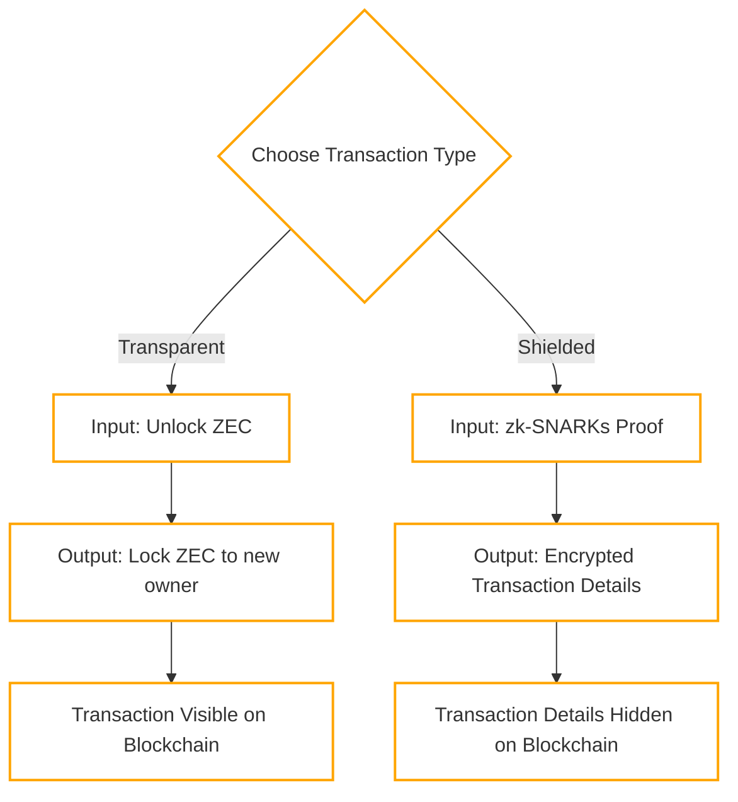
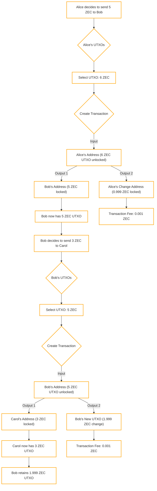

## 7.1.4 Understanding transparent transactions

Zcash supports two types of addresses: transparent (**t-addresses**) and shielded (**z-addresses**). Transparent transactions are like Bitcoin transactions, where the details of the transaction, including sender, receiver, and amount, are publicly visible on the blockchain. 

In a typical blockchain system like Bitcoin or Zcash transparent mode, a transaction includes inputs and outputs. Inputs are the references to previously received tokens (in Bitcoin's terminology, BTC; in Zcash, **ZEC**) that are being spent, while outputs are the new transactions created to transfer value to another address. Essentially, inputs unlock tokens to be spent, and outputs lock these tokens by assigning them to new owners, setting the stage for future transactions​.

The following diagram outlines the difference between transparent and shielded transactions:

Here we are going to be looking at the transparent side, here are the main concepts around a transparent transaction:

- Transparent Addresses: These are similar to Bitcoin addresses, easily recognized because they start with a "t". They allow funds to be sent in a manner where the transaction details (sender, receiver, amount) are visible on the blockchain.
- Transaction Components: A transparent transaction typically consists of **inputs** and **outputs**:
    - Inputs: Reference previous transactions' outputs, unlocking specific amounts of ZEC that were previously received.
    - Outputs: Specify new recipients for ZEC and lock these amounts for future spending.
- UTXOs (Unspent Transaction Outputs): Zcash, like Bitcoin, uses a UTXO model for tracking balances. Each transaction output becomes a UTXO until it is spent as an input in a new transaction.
- Transaction Fees: Just like in Bitcoin, transaction fees in Zcash are deducted from the inputs, incentivizing miners to include transactions in the next block.

### Example

In the following scenario, we look into a more realistic course of transactions as they occur on the blockchain. While wallet software typically manages the internals of these processes, understanding the underlying mechanics offers valuable insights.

The process begins with Alice deciding to send 5 ZEC to Bob. This decision initiates the transaction sequence.

Alice reviews her available UTXOs to find one that can cover the amount she wants to send to Bob. She selects a UTXO valued at 6 ZEC, which is more than the amount she wishes to send.

Create Transaction (Alice):

- Input: Alice unlocks the 6 ZEC from her selected UTXO, indicating she's using this amount for the transaction. This action signifies her intention to transfer part of this amount to Bob.
- Output 1: She designates 5 ZEC to Bob's address. This output specifies the amount Bob will receive.
- Output 2: The remaining balance from the UTXO, minus the transaction fee, is sent back to Alice as change. Given the transaction fee is 0.001 ZEC, Alice's change amounts to 0.999 ZEC.

A small fee (0.001 ZEC) is deducted to cover the cost of processing the transaction. This fee is implicitly included in the transaction by reducing the change Alice receives.

Bob receives the 5 ZEC UTXO from Alice. He then decides to send 3 ZEC to Carol.

Bob uses the 5 ZEC UTXO received from Alice to fund his transaction to Carol.

Create Transaction (Bob):

- Input: Bob unlocks the 5 ZEC UTXO.
- Output 1: He sends 3 ZEC to Carol's address.
- Output 2: Bob receives change from the transaction. After deducting another transaction fee (0.001 ZEC), he is left with 1.999 ZEC.

Similar to Alice's transaction, Bob's transaction incurs a fee of 0.001 ZEC, reducing his change.

Carol now has a new UTXO worth 3 ZEC, and Bob retains a UTXO worth 1.999 ZEC as his change from the transaction.

The process concludes with both transactions successfully executed, fees paid, and new UTXOs created for Bob and Carol.

